# Lazuride iOS Document

## Environment
Xcode 7.3.1  
Swift 2.2  
iPhone 6, iPhone 6s  
iOS 9.3  
Mac OS X EL Capitan 10.11.6   

※実行環境以外での動作は保証・対応できませんので予めご了承ください。  
※インストールする際、予めインストールされている Lazuride iOS を全て削除してください。  
※このリポジトリは Fork しておいてください。(おそらくずっとは上げてないと思うので...)  

## Xcode 7.3.1 のインストール
[ここから](https://developer.apple.com/services-account/download?path=/Developer_Tools/Xcode_7.3.1/Xcode_7.3.1.dmg) Xcode 7.3.1 をインストールします。  
AppStore からもインストールが可能ですが、Lazuride iOS のビルドに対応していない最新バージョンの Xcode 8.1 がインストールされてしまいます。  
※実際にインストールしていたところ、ファイルサイズが 4.85 GB、インストールに必要な容量は 10 GB でした。十分は空き容量を確保してインストールしてください。  

## Lazuride iOS のソースコードを展開
メールにて添付した Lazuride iOS を展開してください。[The Unarchiver](https://itunes.apple.com/jp/app/the-unarchiver/id425424353?mt=12) などを利用すると展開できます。  
※ git の organization に invite する予定でしたが、パッケージ管理ツールや依存パッケージのインストールなどフォローが必要になりそうな手順ががあったので、依存パッケージを含める形で Zip ファイルお渡しするようにしました。(git に依存パッケージを載せるのは避けたかったので...)

## Xcode で Lazuride iOS を開く
Lazuride iOS 展開しディレクトリを開くと、 `Lazuride.xcodeproj` ファイルがあるので Xcode で開いてください。  

## 実機インストールの準備
実機にインストールする前に準備が必要なので、色々設定します。以下の画像を参考に進めて下さい。  
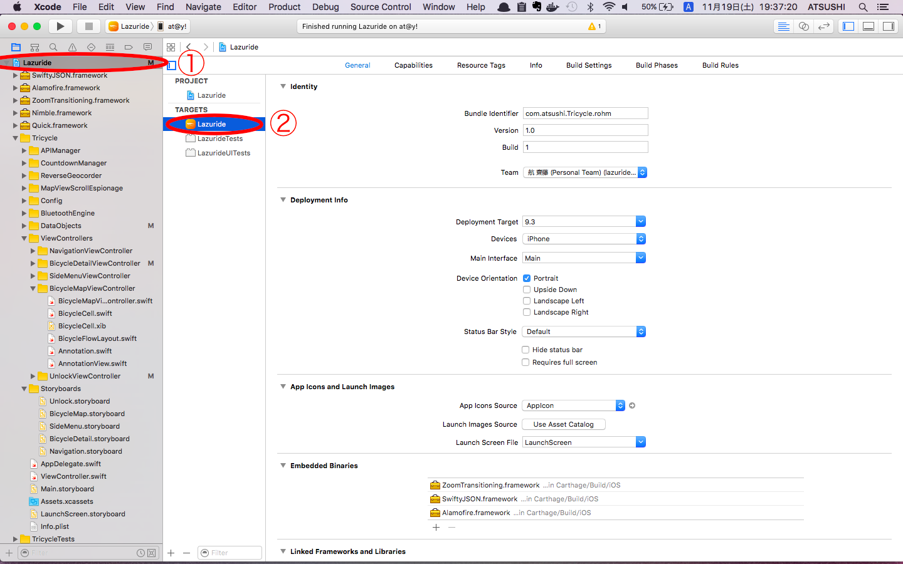  

① の **Lazuride** プロジェクトを選択し、② の TARGET は **Lazuride** を選択します。  

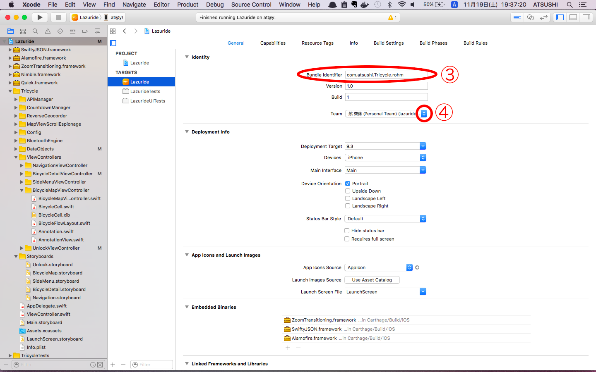

次に ③ の **Bundle Identifier** が `com.atsushi.Tricycle.rohm` になっていることを確認します。もしなっていなければ、 `com.atsushi.Tricycle.rohm` を入力してください。
次に ④ の **Team** 設定を行っていきます。プルダウンをクリックすると以下のようになります。  

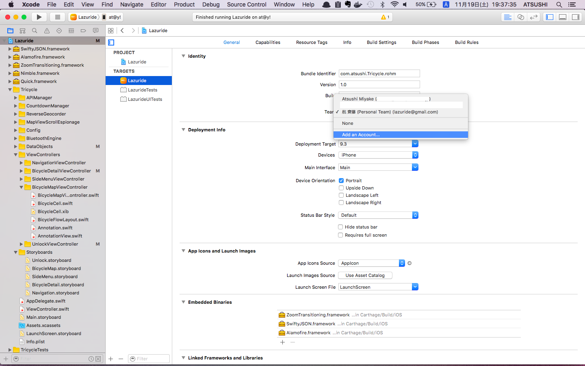

**Add an Account** を選択し、アカウントを追加します。  

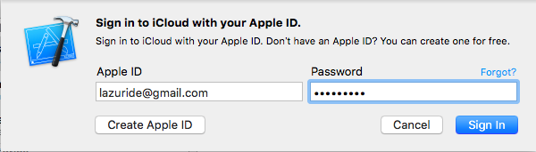

アカウントは予め利用していたものを使ってください。アカウントの詳細(パスワードなど)はメールにてお伝えします。  
入力できたら、**Sign in** でアカウントの追加は終了です。  

## 実機に Lazuride iOS をインストール
実機にインストールしていきます。Lightning ケーブルで iPhone と Mac を接続してください。接続後に以下の通り選択しビルドを行います。  

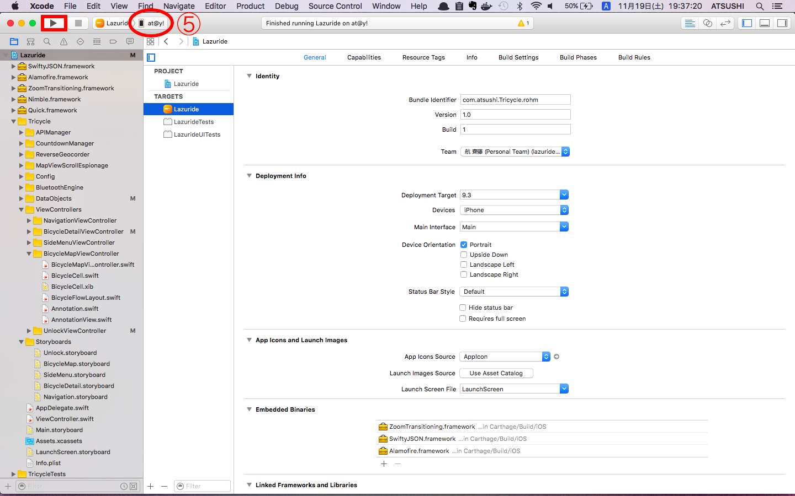

⑤ をクリックするとインストール先を選択できます。**Device** の覧から、接続した iPhone を選択し、**▷** のボタンをクリックしビルドを実行します。このとき、iPhone がロック状態だと自動でアプリが立ち上がらないので、ロックを解除しておいて下さい。  

おそらく初回のインストールでは起動しないと思います。「信頼された開発元」として信頼する必要があるので iPhone の **設定** を開いてください。  
「設定 > 一般 > プロファイルとデバイス管理」へ進み、**デベロッパAPP** の覧の **lazuride@gmail.com** を選択して下さい。**"lazuride@gmail.com"を信頼** をタップすると、**「"iPhone Developer: lazuride@gmail.com (9TYPE9HVWD)"のAppをこのiPhoneで信頼」** というモーダルが表示されるので、信頼をタップして開発元を信頼します。
ここまででインストールした Lazuride iOS を起動できるようになります。Home へ戻ってアプリをタップし動作を確認してください。

# About Application
ここから下は特にインストールに関係ありません。もともと用意していた README です。

## Color Code
- テーマカラー: <span style="background-color: #FF6600">#FF6600</span>
- バックグラウンドカラー: <span style="background-color: #F4DF27; color: #8A4B08">#F4DF27</span> - <span style="background-color: #E65C2F">#E65C2F</span>

## ViewControllers
### SideMenuViewController
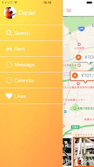

BicycleMapViewController で利用するためのサイドメニュー。BicycleMapViewController のハンバーガーアイコンをタップするとスライドし、スライドした View をタップもしくはスライドすることでサイドメニューを閉じる。

### BicycleMapViewController
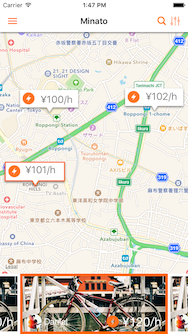 

Tricycle に登録された自転車情報をマップに表示する画面。Bottom には、現在 Map に表示されている自転車の画像を CollectionView で表示し、CollectionView をスライドすることで Map 上の該当自転車がセンタリングする。

### BicycleDetailViewController
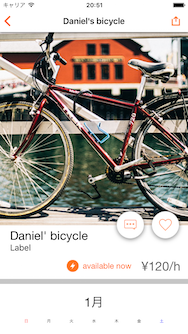 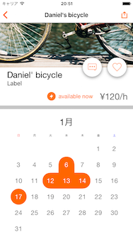

BicycleMapViewController に表示されている CollectionView の Cell がタップされた時に表示される自転車の詳細画面。カレンダーには、予約されている日に色がつく。

### UnlockViewController
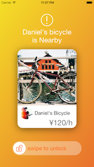

スマートロックを解除するための画面。スマートロックに近づくと自動で接続され、この画面が表示される。スライドすることでBluetooth で解除を行う。事前に予約を行った自転車しか解除することはできない。  

## Install Carthage
```
$ brew install carthage  
```  

## Install frameworks
```
$ carthage bootstrap --platform iOS

// 上記でエラーが出る場合は以下
$ carthage update --platform iOS

// bootstrap は  ファイルからパッケージのインストールを行うので update でインストールした場合、バージョンが保証されないので注意。
```

## Import frameworks
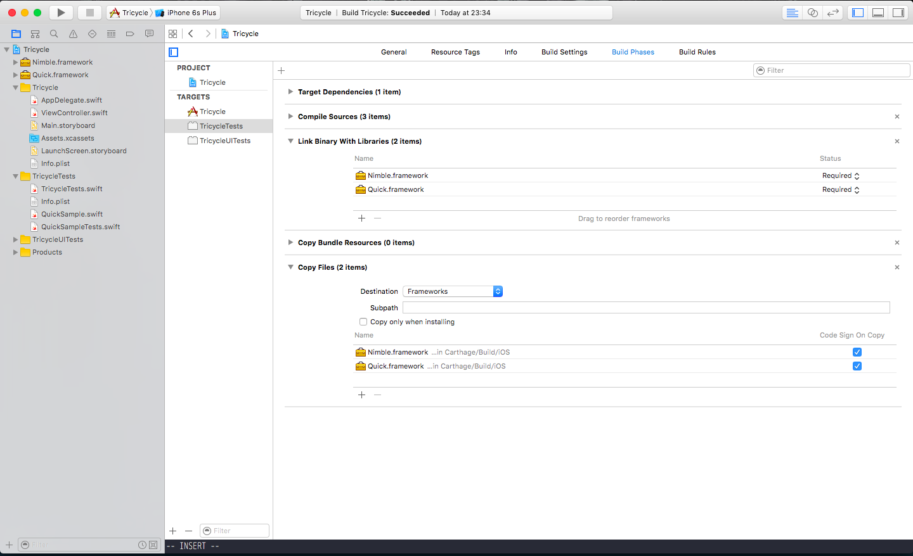

- 左のプロジェクトから一番上の `Tricycle` を選択する。Target の TricycleTests を選択し Build Parse タブをクリック。`Link Binary With Libraries` に `./Carthage/Build/iOS`にある `Nimble・Quick.framework` をドラッグ&ドロップで import する。

- 同じ画面の左上にある + ボタンをクリックし、`New Files Phase` を選択。一番下に新しく Copy Files が生成されるので、下の + ボタンをクリックし、`Nimble.framework` と `Quick.framework` を選択し add する。

- `Cmd + B` でビルドし、エラーがでなければ Quick の導入が完了。

## Author
Atsushi Miyake  
2016/11/19  
